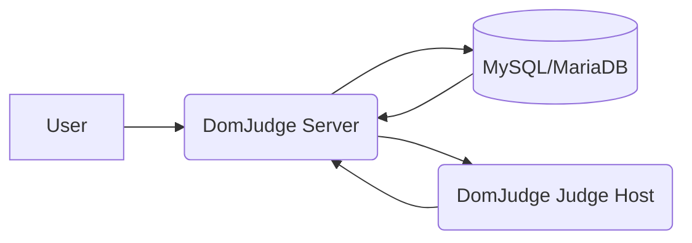
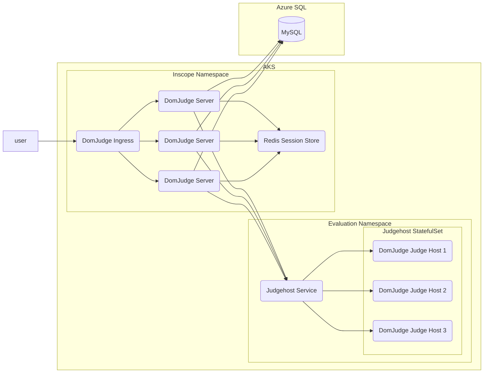

# Domjudge on k8s, the highly available Online Judge we all want

## Architecture

Generally, DomJudge is composed of 3 main components that interact in way described below:

- `DomJudge Server` component is responsible for getting submissions from participants interfaces, evaluating submissions by communicating with the `DomJudge Judge Host` and updating `MySQL` database with the submission evaluation. It is like the frontend i.e. anything from creating of problems to conducting competitions is done through this interface or it's [Web APIs](https://www.domjudge.org/demoweb/api/doc).
- `DomJudge Judge Host` component is responsible for evaluating submissions in various languages required by the contest organizers. It evaluates submissions, looking for `RTEs`, `TLEs`, `WA` or a great `Correct` submission to some problem. It is the most critical component to conduct competitions. And scaling it can be often a real pain (not nowadays though) because it stores some state of submissions, and has an hard requirement for a **CPU core per Judge Host**, and **access to `cgroups` (maybe I can use some help to get this working)** and is not easy to scale out while keeping the data consistent.
- `MySQL/MariaDB` component, well, it stores your data. That's it, that what it does.

## Architecture on K8s

Now let's talk about moving these hard to use components onto Kubernetes. We will implement following architecture using Microsoft Azure Cloud, but you could use this architecture with required components anywhere. Be it, AWS, Google Cloud, or Digital Ocean.

So, we will need the above components to deploy DomJudge to our K8s cluster on AKS.

So, lets get the cluster itself up and running with a Azure SQL database using `terraform`. Then we can come towards applying the Kubernetes configs and get the ball rolling.

## Todo next:

- [ ] IaC with Terraform